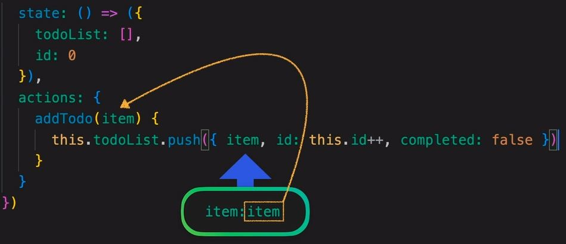

<br>

# Pinia Hand note
<br>

> A hand note of Pinia journey.....

<br>

| Key Note                    |                      |                |                       |
|-----------------------------|----------------------|----------------|-----------------------|
| **Emoji**                    | **Description**          | **Emoji**   | **Description**       |
| 🌴                           | **Main Topic**       | 📌             | **Regular Note**      |
| 🌿                           | **Paragraph**        | 💎             | **High Value info**   |
| 📕                           | **Heavy Note**       | 🧨             | **Careful this**      |
| 🍂                           | **Attention Note**   | ✋             | **Stop! check the point** |
| 🏷️                          | **Regular Note**     | 🎯             | **Focus**             |


<!-- NO COMMENT -->

## Table of Contents

- [🌴 For setting up the project](#-for-setting-up-the-project)
- [🌴 Setting up the development environment](#-setting-up-the-development-environment)
- [🌴 Project structure](#-project-structure)
- [🌴 Showing Data from variable to template](#-showing-data-from-variable-to-template)
- [🌴 Showing data from Object](#-showing-data-from-object)

## Pattern for State management:
**Vue Vs Pinia** 
<br>
<br>


- Vue use ``` data: {} ``` for storing data, on the other hand pinia use ``` state: {} ```
<br>

- Vue use ``` methods: {} ``` for updating data of local state , on the other hand pinia use ``` actions: {} ```

<br>

- Vue use ``` computed: {} ``` for returning process version data without effecting original data, on the other hand pinia use ``` state: {} ```
<br>


## What is a Store?
<br>
A Store (like Pinia) is an entity holding state and business logic that isn't bound to your Component tree. In other words, it hosts global state. It's a bit like a component that is always there and that everybody can read off and write to. It has three concepts, the state, getters and actions and it's safe to assume these concepts are the equivalent of data, computed and methods in components.

<br>

## When should I use a Store
<br>

A store should contain data that can be accessed throughout your application. This includes data that is used in many places, e.g. User information that is displayed in the navbar, as well as data that needs to be preserved through pages, e.g. a very complicated multi-step form.

On the other hand, you should avoid including in the store local data that could be hosted in a component instead, e.g. the visibility of an element local to a page.

Not all applications need access to a global state, but if yours need one, Pinia will make your life easier.

**Learning By Project** 
## Installation:  
<br>
01: 
Install pinia:
<br>

```
yarn add pinia

# or with npm

npm install pinia

```
<br>
Create a pinia instance (the root store) and pass it to the app as a plugin:
<br>
 
```
<!-- main.js  -->

import { createApp } from 'vue'
import { createPinia } from 'pinia'
import App from './App.vue'

const pinia = createPinia()
const app = createApp(App)

app.use(pinia)
app.mount('#app')

```
<br>

## Creating First Store:

<br>
01: create components of TodoAPP.vue, TodoForm.vue, TodoList.vue.
02: import TodoForm.vue, TodoList.vue. in TodoApp.Vue.
03: and import TodoApp.vue in App.vue. and delete every thing of App.Vue rest.

04 Store Create:
create stores folder and create in the todoList.js
<br>

```
import { defineStore } from 'pinia'

export const useTodoListStore = defineStore('todoList', {
  
  // State
  // getters
  // actions
})

```
<br>
now create Global state object ``` state: () => ({ todoList: []}) ```
<br>
And final code will be like below,
<Br>

```
import { defineStore } from 'pinia'

export const useTodoListStore = defineStore('todoList', {
  state: () => ({
    todoList: [],
  })
})
```
## Mutating state with action:
<br>
1. now create action: where we will add toDO item into the state,

```
actions: {
    addTodo(item) {
        this.todoList.push({item, id: this.id++})
    }
}
```
<br>
2. also add id:0 property to the state: Since we want to has id in each item while increment in pushing into the array. 
<br>

```
import { defineStore } from 'pinia'

export const useTodoListStore = defineStore('todoList', {
  state: () => ({
    todoList: [],
    id: 0
  })
})
```

<br>
3. and each toDo will start out as incomplete  ``` completed: false ```
<br>

<br>
4. we can also write to action for deleting item by filtering the id on the toDo object. 

```
deleteTodo(itemId) {
      this.todoList = this.todoList.filter((object) => {
        return object.id !== itemId
      })
    }

```

<br>
5. Now create simple form: 
<br>

```
<script setup>
import { ref } from 'vue'
import { useTodoListStore } from '@/stores/todoList'

const todo = ref('')
const store = useTodoListStore()

function addItemAndClear(item) {
  if (item.length === 0) {
    return
  }
  // invokes function in the store:
  store.addTodo(item)
  todo.value = ''
}
</script>

<template>
  <div>
    <form @submit.prevent="addItemAndClear(todo)">
      <input v-model="todo" type="text" /><button>Add</button>
    </form>
  </div>
</template>

<style scoped>
</style>
```
<br>
- in here we use ``` ref('') ``` to reactive the form. which will update the value of the user types in the input. 
- now we have to access the store so we use:
<br>

```
import { useTodoListStore } from '@/stores/todoList'

const store = useTodoListStore()

```
<br>

- then we validate the input, if ok we sent the item and clear the form:
<br>

```
function addItemAndClear(item) {
  if (item.length === 0) {
    return
  }
  // invokes function in the store:
  store.addTodo(item)
  todo.value = ''
} 
```
- then we add the funciton in the form submit handler:

```
<form 
@submit.prevent="addItemAndClear(todo)"
> 
<from/>

```


