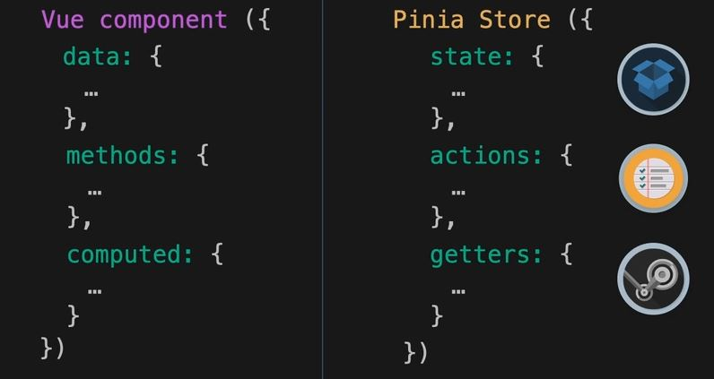
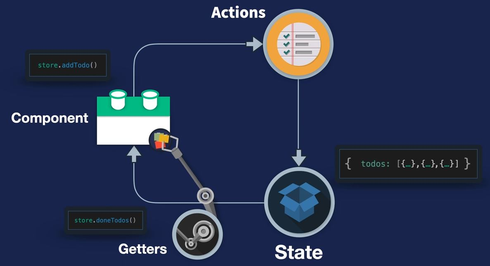

<br>

# Pinia Hand note
<br>

> A hand note of Pinia journey.....

<br>

| Key Note                    |                      |                |                       |
|-----------------------------|----------------------|----------------|-----------------------|
| **Emoji**                    | **Description**          | **Emoji**   | **Description**       |
| 🌴                           | **Main Topic**       | 📌             | **Regular Note**      |
| 🌿                           | **Paragraph**        | 💎             | **High Value info**   |
| 📕                           | **Heavy Note**       | 🧨             | **Careful this**      |
| 🍂                           | **Attention Note**   | ✋             | **Stop! check the point** |
| 🏷️                          | **Regular Note**     | 🎯             | **Focus**             |


<!-- NO COMMENT -->

## Table of Contents

- [🌴 For setting up the project](#-for-setting-up-the-project)
- [🌴 Setting up the development environment](#-setting-up-the-development-environment)
- [🌴 Project structure](#-project-structure)
- [🌴 Showing Data from variable to template](#-showing-data-from-variable-to-template)
- [🌴 Showing data from Object](#-showing-data-from-object)

## Pattern for State management:
**Vue Vs Pinia** 
<br>
<br>



- Vue use ``` data: {} ``` for storing data, on the other hand pinia use ``` state: {} ```
<br>

- Vue use ``` methods: {} ``` for updating data of local state , on the other hand pinia use ``` actions: {} ```

<br>

- Vue use ``` computed: {} ``` for returning process version data without effecting original data, on the other hand pinia use ``` state: {} ```
<br>

